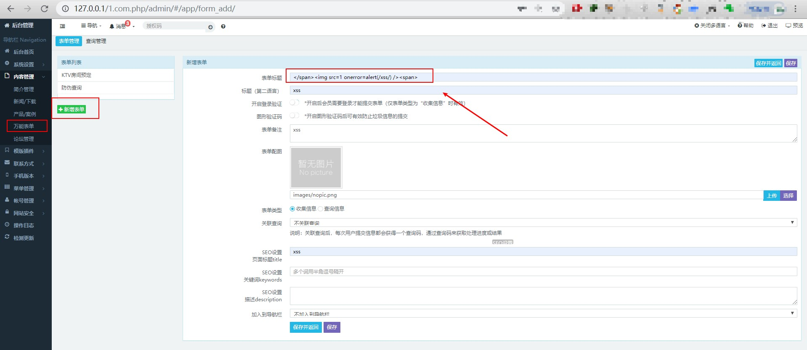

## recycle bin storage XSS

There is a storage XSS vulnerability in the background of the s-cms enterprise website building system (PHP version). The attacker logs in to the administrator background and puts malicious js code,serious threat to network security.

## exploit

### 1 Client login to management system, `内容管理`->`万能表单`->`新增表单`，input `` in the title entry box,then click save and return.

### 2 in `内容管理`->`万能表单` list,we can see new the form,then click `删除`(delete).

### 3 click `网站安全`->`回收站`,trigger XSS vulnerability.

### 4 Vulnerability system is the latest version，[S-CMS Enterprise Station Building System (php version)v3.0](https://cdn.shanling.top/file/1.com.php.zip)